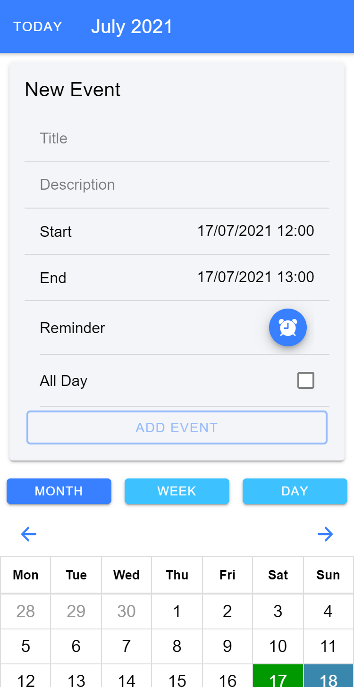
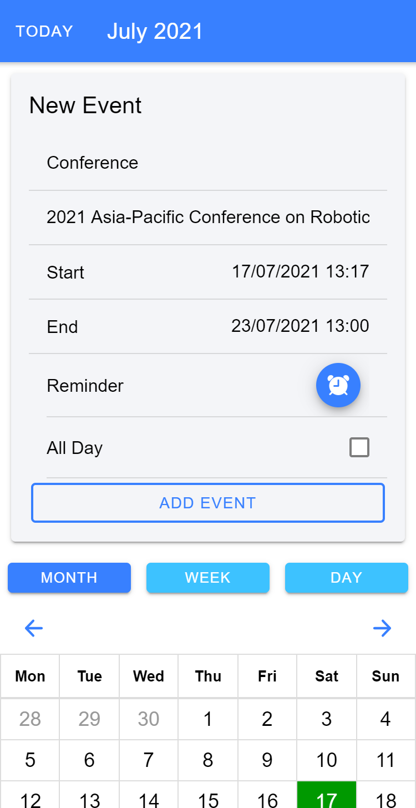
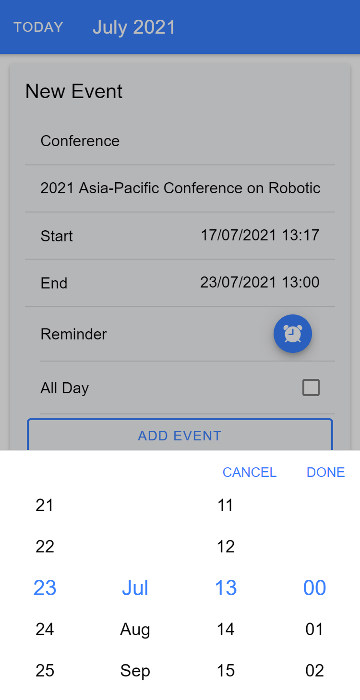
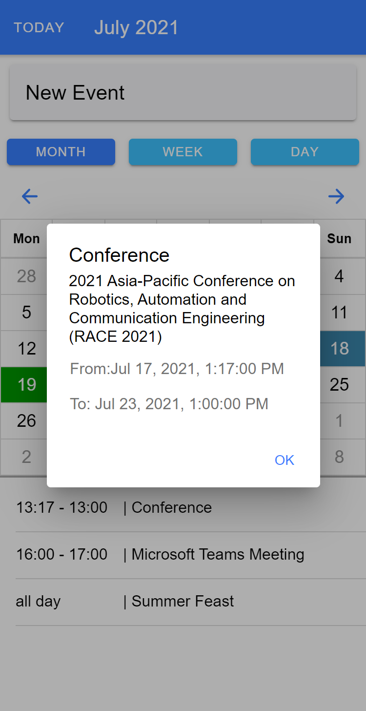
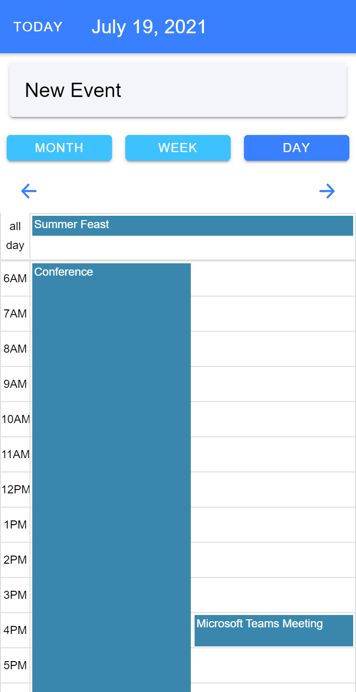
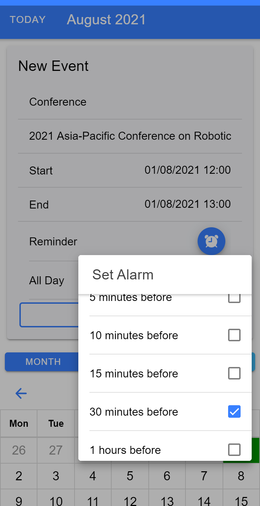

<h1 align="center">IonCalendar </h1>
<p align="center"> 📆 A basic calendar application built with Ionic v5.</p>

<p align="center">
  <a href="https://github.com/enessfk/ionic-calendar-app/issues">Report Bug</a> · 
  <a href="https://github.com/enessfk/ionic-calendar-app/issues">Request Feature</a>
</p>

<!--
## Table of Contents
   * [About](#about)
      * [Built with](#built-with)
      * [How does it work?](#how-does-it-work)
   * [Getting Started](#getting-started)
      * [Prerequisites](#prerequisites)
      * [Installation](#installation)
   * [Screenshots](#screenshots)
   * [Contributing](#contributing)
   * [License](#license)
-->
## About


IonCalendar is a basic calendar application made using Ionic and Angular. In addition to the features to schedule and display events, it has the feature to switch between three different views: month, week and day.

### Built with

- [Ionic v5](https://ionicframework.com/docs) - Ionic Framework is the open-source mobile app development framework that makes it easy to build top quality native and progressive web apps with web technologies. 
- [Angular v11](https://angular.io/) - Angular is a TypeScript-based free and open-source web application framework led by the Angular Team at Google and by a community of individuals and corporations.
- [TypeScript](https://www.typescriptlang.org/) - TypeScript is a programming language developed and maintained by Microsoft. It is a strict syntactical superset of JavaScript and adds optional static typing to the language. 


<p align="center"> 
<a href="https://ionicframework.com/">
  
</a>&nbsp;
  
<a href="https://angular.io/">
  
</a>&nbsp;
  
<a href="https://www.typescriptlang.org/">
  
</a>&nbsp;
</p>  

### How does it work?

This project uses one of the best calendar components for Ionic called [ionic2-calendar](https://www.npmjs.com/package/ionic2-calendar). It is up to date for all Ionic versions. Take a look into link to know more about it.

## Getting Started

The following instructions will get you a copy of the project up and running on your local machine for development and testing purposes.

### Prerequisites

To run this project in production or development mode you have to make sure, `ionic` and `cordova` are installed globally on your computer. 

Before proceeding, also check if [Node.js](https://nodejs.org/en/) (bundled with [npm](https://www.npmjs.com/)) is installed. It is recommended to select the LTS version to ensure best compatibility.


- To check if it is installed:
```bash
node --version
npm --version
```
- Install ionic and cordova command line interface globally:
 ```bash
npm install -g ionic cordova
```
### Installation

To get this project, clone the repository directly using git or download a zip copy from the [master branch on Github](https://github.com/enessfk/ionic-calendar-app/archive/refs/heads/master.zip).

```bash
git clone https://github.com/enessfk/ionic-calendar-app.git IonCalendar
```

To install the dependencies, run this in the application folder from the command-line:

```bash
npm install
```

### Running the app in your browser:

```bash
ionic serve
```
### Running the app on your device:

Add an iOS or Android platform to the project:

```bash
ionic cordova platform add ios 
# or 
ionic cordova platform add android
```

Run the app on your device:

```bash
ionic cordova run ios
# or
ionic cordova run android
```

*For further information please read [ionic's deployment guide](https://ionicframework.com/docs/intro/deploying/).*

## Screenshots

<p>
   &emsp;
   &emsp;
  
</p>  
<p>
   &emsp;
   &emsp;
  
</p>


## Contributing
Want to contribute? Great!
To fix a bug or enhance an existing module, follow these steps:

1. Fork the Project
2. Create your Feature Branch (`git checkout -b feature/enhanced-feature`)
3. Commit your Changes (`git commit -m 'Add some enhanced-feature'`)
4. Push to the Branch (`git push origin feature/enhanced-feature`)
5. Open a Pull Request

## License

Distributed under the MIT License. See `LICENSE` for more information.

